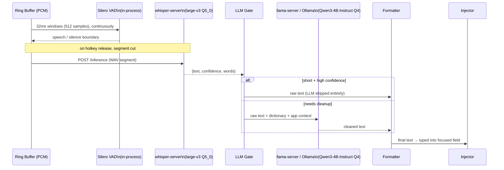

# mockingbird — models

> **Status:** v1 design, pre-code — reflects the model choices fixed in
> [ARCHITECTURE.md §3](./ARCHITECTURE.md#3-technology-stack) and
> [§6](./ARCHITECTURE.md#6-the-dictation-pipeline).
> **Owner:** bhattacharjeenirjhar26@gmail.com
> **Last updated:** 2026-09-16

Every model mockingbird runs, runs **on-device**, loaded from
`~/.mockingbird/models/` and served by a local subprocess bound to
`127.0.0.1` — never a hosted API. See
[SECURITY_PRIVACY.md §3](./SECURITY_PRIVACY.md#3-network-policy) for the
network guarantee this depends on. This doc is the inventory of *which*
models, *where* in the pipeline each one sits, and *how* it's invoked.

## Table of contents

1. [Model inventory](#1-model-inventory)
2. [Where each model sits in the pipeline](#2-where-each-model-sits-in-the-pipeline)
3. [Voice activity detection — Silero VAD](#3-voice-activity-detection--silero-vad)
4. [Speech-to-text — Whisper (whisper.cpp)](#4-speech-to-text--whisper-whispercpp)
5. [Cleanup / formatting LLM — Qwen3-4B-Instruct](#5-cleanup--formatting-llm--qwen3-4b-instruct)
6. [Vector search — sqlite-vec (not a model)](#6-vector-search--sqlite-vec-not-a-model)
7. [Model swapping & configuration](#7-model-swapping--configuration)
8. [Acquisition, storage & integrity](#8-acquisition-storage--integrity)
9. [Licensing](#9-licensing)

---

## 1. Model inventory

| Model | Role | Runs via | Runs as | Default size class |
|---|---|---|---|---|
| **Silero VAD** | Voice activity detection — decide when speech starts/stops in the audio stream | `onnxruntime-node` | native module, in-process | ~1–2 MB (ONNX) |
| **Whisper `large-v3`, Q5_0** | Speech-to-text (ASR) — audio → raw transcript | `whisper.cpp` (`whisper-server`) | subprocess, HTTP `:8771` | 1.08 GB quantized |
| **Qwen3-4B-Instruct, Q4** | Cleanup/formatting LLM — raw transcript → cleaned, punctuated, formatted text | Ollama **or** `llama-server` (llama.cpp) | subprocess, HTTP `:8772` | ~2.5–3 GB quantized |

Three models, three distinct jobs, three different runtimes — deliberately
not consolidated into one model, because VAD needs to be near-instant and
tiny, ASR needs to be accurate on raw audio, and the cleanup LLM needs
instruction-following on already-transcribed text, and no single model in
this size range is best at all three.

## 2. Where each model sits in the pipeline

This mirrors [ARCHITECTURE.md §6](./ARCHITECTURE.md#6-the-dictation-pipeline)
exactly — see that section for the full FSM context around it. The one
routing decision worth calling out here: **the LLM is conditionally skipped**
by the LLM Gate for short, high-confidence utterances, so a quick "yes" or
"ok" never pays LLM latency it doesn't need. VAD and ASR are never skipped —
every captured segment goes through both.

## 3. Voice activity detection — Silero VAD

- **Job:** classify 32ms audio windows (512 samples at 16kHz, the size
  Silero v5 requires, with the previous window's last 64 samples prepended
  as context) as speech/silence in real time, while
  the ring buffer is filling, to find utterance boundaries (and to detect
  700ms of silence as the auto-chunk boundary in `CAPTURE_LOCK` mode — see
  [ARCHITECTURE.md §5](./ARCHITECTURE.md#5-the-hotkey-state-machine)).
- **Where it's used:** continuously, in-process, on the always-running ring
  buffer — this is the only model that runs even when the hotkey isn't
  pressed (it's how the ring buffer knows what "speech" looks like for
  pre-roll purposes).
- **How it's invoked:** loaded once at daemon startup via
  `onnxruntime-node`, called synchronously per-frame from the `SEG` stage in
  [the system architecture diagram](./ARCHITECTURE.md#4-system-architecture).
  No HTTP hop — it's a native module call in the same process.
- **Why this model:** small enough to run per-frame with negligible CPU
  cost, purpose-built for VAD (not a general audio model repurposed for it),
  and ships as ONNX so it loads through the same `onnxruntime-node`
  dependency without needing a second inference runtime.

## 4. Speech-to-text — Whisper (whisper.cpp)

- **Job:** convert a cut audio segment (PCM, 16kHz) into a raw text
  transcript, plus a `confidence` score (mean probability of the spoken,
  non-punctuation words) used by the LLM Gate's skip decision.
- **Where it's used:** once per finalized utterance — triggered when the
  hotkey is released (`CAPTURE_PTT`) or a silence boundary is hit in lock
  mode (`CAPTURE_LOCK`). Never runs continuously; only on a cut segment.
- **How it's invoked:** `whisper-server`, a supervised child process running
  `whisper.cpp`, listening on `127.0.0.1:8771`. The daemon `POST`s the
  segment as a WAV upload to `/inference` (`response_format=verbose_json`)
  and gets back `{text, confidence, words}`. It starts with `-nlp` when the
  installed version has it: without that, every `verbose_json` request runs
  the encoder a second time just to report a language probability, which
  costs ~1.2s per dictation with `large-v3` on an M3. First start on a machine takes
  ~15s while Metal compiles its shaders (cached afterwards), which is why it
  runs as a long-lived child rather than per dictation. If
  `whisper-server` dies, the supervisor restarts it — dictation queues or
  degrades rather than silently failing, per the "degrade, don't break"
  principle in [ARCHITECTURE.md §2](./ARCHITECTURE.md#2-core-principles).
- **Model file:** `large-v3`, quantized to `Q5_0` (1.08 GB), downloaded by
  `mockingbird models pull` (`apps/daemon/src/models.ts`) and the default in
  `apps/daemon/src/runtime.ts`. It is
  multilingual, which is what makes it hold up on accented English where the
  English-only models drop words; requests pin `language=en` so it doesn't
  drift to another language.
- **Measured on an M3 (warm server, 4.5s clip, median of 3 —
  `bun run bench:models`):** `base.en` 177ms, `small.en` Q5_1 533ms,
  `medium.en` Q5_0 1508ms, `large-v3-turbo` Q8_0 2142ms, `large-v3-turbo`
  Q5_0 2248ms (before `-nlp`; the current comparison is in §7a). The encoder alone is ~1.1s of that on the GPU, and the
  Homebrew `whisper-cpp` has no Core ML encoder, which would cut it. Accuracy
  was chosen over speed here; `MOCKINGBIRD_ASR_MODEL` takes a file name in
  `models/` or a path, so a slower Mac can drop to `small.en`.
- **Full precision is not better.** `ggml-large-v3.bin` (f16, 3.1 GB) wrote
  "Nirjher" and "Zia Ming Zhao" where Q5_0 (1.08 GB) wrote "Nirjhar
  Bhattacharjee" and, with the dictionary, "Xiaoming Zhao". Quantization is
  not what limits name spelling, so Q5_0 stays.
- **`large-v3` over `large-v3-turbo`, because of names.** Turbo is a distilled
  model with a much smaller decoder, and that is where the knowledge of
  unusual names lives. Measured on synthetic speech naming four people:
  turbo wrote "Nurj Harbada Charjee" and "Aishwarya Venkatasan"; `large-v3`
  wrote "Nirjhar Bhattacharjee" and "Aishwarya Venkatesan" with no glossary.
  Both missed "Xiaoming Zhao", which is what the user dictionary is for. The
  cost is ~0.5s on a short dictation (2.6s vs 2.1s) and ~3s on a 57s one.
  A production dictation app cannot spell South Asian and East Asian names
  phonetically, so the slower model is the right default.
- **Q8_0 over Q5_0** for turbo, measured on a 57s recording of real speech: Q8_0 both
  reads better ("I just woke up, it's my birthday" where Q5_0 gave "with my
  birthday", "Fixed punctuation" where Q5_0 gave "Exponctuation") and runs
  slightly faster (4843ms vs 5007ms). The 300 MB is worth it.
- **Too little silence around the speech loses whole passages.** On that same
  recording, `large-v3-turbo` with 700ms of padding dropped a 20-second
  stretch from the middle (373 characters instead of 650); at 1500ms it
  transcribed all of it. Whisper decides per 30-second window whether a
  stretch is speech, and a tight cut pushes that decision the wrong way.
  `-nth` (no-speech threshold) and `-sns` made no difference — padding did.
  `large-v3` (non-turbo) never dropped it at any padding, but takes ~7s to
  turbo's ~3.8s on a 57s clip, and was no more accurate here.
- **How the audio is cut matters as much as the model.** On the same
  recording, cutting the silences out of the middle, or trimming tight to the
  speech, produced wrong words and capitals mid-sentence; keeping the
  silences and padding ~1s either side produced clean sentences. `trimToSpeech`
  does the latter — Whisper reads a sentence from the rhythm around it, not
  only from the words.
- The integration tests still use `base.en` (~148 MB), which keeps them
  quick; it is not what ships.

### 4a. The user dictionary — `~/.mockingbird/dictionary.txt`

No model spells a name it has never seen; every dictation app relies on being
told. The file lists the words that matter to this person, one per line, and
feeds three places (`packages/llm/src/dictionary.ts`):

| Line | What it does |
|---|---|
| `Nirjhar Bhattacharjee` | Given to Whisper before it listens (`prompt`), and to the cleanup model as a spelling to keep |
| `Catppuccin (a colour theme)` | Same, with a note for the cleanup model |
| `cat puck => Catppuccin` | A plain replacement afterwards, for a word Whisper gets wrong the same way every time |

**A term is matched by sound, not spelling** (`correctNames`, `soundOf`).
Whisper writes an unfamiliar name as it hears it, and never the same way
twice: "Nurj Harbada Charjee", "Nerj Herbata Chargy". Comparing letters finds
neither. `soundOf` reduces a word to its consonant skeleton with the
distinctions that don't survive mishearing folded together — aspirated
consonants (`bh`→`b`), `c`/`k`/`q`, `sh`/`ch`/`j`/`z`/`x`, `v`/`w` — and spans
of one to four words are compared against each term. Measured on the
benchmark transcripts: all three manglings above resolve to the right name,
while "llama", "categorise the puck", "Richard" and "Sid and Ash" are left
alone. A word only joins a span if including it improves the match, so
"and Siddharth Mukherjee" doesn't swallow the "and".

**Reading the words to Whisper is opt-in** (`MOCKINGBIRD_ASR_VOCABULARY=1`),
because it cuts both ways. Measured on one sentence: with `base`-level models
the hint rescued a name entirely ("Nerj Herbata Chargy" → "Nirjhar
Bhattacharjee"), and on `large-v3` it fixed "Zaya Mingjiao" → "Xiaoming Zhao"
— but in the same breath it bent two names the model had already spelled
right, "Bhattacharjee" → "Bhattacharje" and "Aishwarya" → "Aiishwarya". The
prompt biases the whole decode, not just the word it was given. The
replacement lines carry no such risk, so they are the default advice. Whisper
takes at most 224 tokens of prompt, so `buildVocabularyPrompt` stops at 600
characters. The file
is created with instructions in it on first run, and read at startup — it
takes effect on `mockingbird restart`. `docs/DATABASE.md` has a `dictionary`
table planned; the file is what exists today, and the TUI editor will write
the same words.

## 5. Cleanup / formatting LLM — Qwen3-4B-Instruct

- **When its output is rejected:** `acceptCleanup` falls back to the raw
  transcript when the cleaned text is far shorter than what went in (80% for
  text over 120 characters, 50% below that) or far longer, or when it looks
  like an answer rather than a rewrite.
- **Lists.** Speech that enumerates things ("I'll get onions, I'll get
  bread") is rewritten as a short heading plus one `- ` item per line, with
  the repeated lead-in dropped. `looksLikeList` keeps such speech from
  skipping the model, since only the model can do this, and the prompt carries
  two worked examples — with one grocery example only, qwen3 handled "I will
  get onions" but left "I need to" on every line of a list of tasks.
  `bulletize` is the backstop for that failure: when the model returns one
  line per item but repeats the same lead-in ("I need to", "I will"), it
  strips the lead-in and bullets the lines itself, moving a time word to the
  end of its item ("Tomorrow I need to run a marathon" → "- run a marathon
  tomorrow"). It needs at least three lines, 60% of them sharing the lead-in,
  and leaves prose and already-bulleted lists untouched. `acceptCleanup` allows a list down to 0.3 of the raw length,
  because "I will get onions" legitimately becomes "- onions".
- **Sequences.** Steps done in an order ("first boil the water, then add the
  tea, finally add milk", "number one ... number two", "step one ...") become
  a numbered list (`1. `, `2. `) rather than bullets, and `looksLikeList`
  counts ordinals and "next", "after that", "finally" as list markers. A list
  needs three or more items: with fewer, qwen3 tended to force a sentence
  into a list by dropping half of it ("ship it, but first run the tests" →
  "- Run the tests first"), so `acceptCleanup` rejects a list of one or two
  items and the transcript is typed as a sentence. The prompt also keeps a
  story about what already happened ("we landed, then took a train") as
  prose.
- **The prompt** is `packages/llm/prompts/cleanup.md`, in sections that
  `buildCleanupPrompt` assembles per dictation. `## Rules` always goes in.
  `## Lists` goes in only when `looksLikeList` says so, because with the list
  rules in every prompt qwen3 turned plain sentences into lists ("Meeting:\n-
  Thursday", which `acceptCleanup` then rejected, leaving the fillers in).
  `## Terminal` and `## Dictionary` are added when they apply. Change it
  against `bun run eval:cleanup` and the held-out set. One cost to know. Ollama
  reuses the processed start of a prompt between calls, so a list dictation
  that follows a non-list one processes the list section afresh, about
  0.5s more than a list after a list.
- **When it runs:** only when the transcript needs it. `shouldSkipLlm`
  (`packages/llm/src/cleanup.ts`) skips cleanup for very short utterances, and
  for confident transcripts that carry no filler word and no stutter —
  `formatText` supplies the capital and the end punctuation without a model.
  Cleanup costs 400-1500ms, which is most of the wait after speaking.
- **Job:** take the raw ASR transcript plus context (user dictionary,
  frontmost-app profile) and produce the final text — punctuation,
  capitalization, disfluency removal ("um", false starts), per-app style
  (e.g. no auto-caps in Terminal), and voice-command interpretation.
- **Where it's used:** only when the LLM Gate decides cleanup is needed —
  short, high-confidence utterances skip straight from ASR to the Formatter.
  This is the one model in the pipeline that's *conditionally* invoked.
- **How it's invoked:** either Ollama or `llama-server` (llama.cpp),
  supervised subprocess, `127.0.0.1:8772`. The daemon sends the raw text
  plus the relevant slice of the `dictionary` table and the current
  `app_profile` row (see [the SQLite schema](./ARCHITECTURE.md#7-where-sqlite-fits))
  as prompt context, and gets cleaned text back.
- **Model file:** `Qwen3-4B-Instruct`, quantized to `Q4`. Chosen as an
  instruction-tuned model small enough to run acceptably on a laptop GPU/CPU
  while still following formatting instructions reliably.
- **Streaming:** the reply is read as Ollama writes it (`stream: true`), and
  the transcript's own words are typed as they arrive (ARCHITECTURE.md §6).
  The model's speed still sets when the last word lands; what changes is
  when the first one does. Two Ollama cache slots (`OLLAMA_NUM_PARALLEL=2`)
  were tried to keep the list and non-list prompts both cached, and changed
  nothing: Ollama 0.34.4 doesn't send a prompt back to the slot holding it.
- **Fallback behavior:** if this server is down, dictation falls back to raw
  ASR output rather than blocking — same degrade-don't-break principle as
  `whisper-server`.

## 6. Vector search — sqlite-vec (not a model)

`sqlite-vec` (mentioned in [ARCHITECTURE.md §7](./ARCHITECTURE.md#7-where-sqlite-fits))
is a SQLite extension for storing and querying vector embeddings, loaded
directly into `data.db` via `db.loadExtension()` — **it is not itself a
model**, and no embedding model is chosen yet. Semantic search over
utterance history and dictionary terms is listed as v1.x/optional scope; if
built, it will need its own embedding model entry in this doc (likely a
small local sentence-embedding model, on-device for the same reasons as
everything else in this file). Tracked as undecided, not silently assumed.

## 7. Model swapping & configuration

- **ASR and LLM are both swappable via config** — per
  [ARCHITECTURE.md §3](./ARCHITECTURE.md#3-technology-stack), the `asr` and
  `llm` packages are designed so the base URL and model name are
  configuration, not hardcoded, specifically so a different model size (or,
  per [ARCHITECTURE.md §13](./ARCHITECTURE.md#13-is-docker-needed), a
  `llama-server` running on a separate machine on the LAN) can be substituted
  without a code change.
- **VAD is not currently designed as swappable** — Silero via
  `onnxruntime-node` is treated as a fixed part of the pipeline, not a
  configurable choice, since its cost/accuracy profile isn't a tradeoff most
  users need to tune.
- Model choice (which Whisper size, which LLM) is expected to live in the
  `settings` table (see [state ownership map](./ARCHITECTURE.md#8-state-ownership-map))
  and be editable via the TUI or a future `mockingbird config` CLI — exact
  surface undecided, see [ARCHITECTURE.md §16](./ARCHITECTURE.md#16-known-gaps--scope-not-yet-decided).

### 7a. Which models, measured (2026-10-03)

The question is whether a Whisper model and a cleanup model exist that are
faster, smaller to download and lighter on memory, without being less
accurate. The rule for switching a default is that the new model is at least as accurate
**and** measurably faster or smaller. Accuracy alone, or speed alone, isn't
enough.

**Whisper,** `bun run bench:models`, on an M3 (16 GB), warm server. 64 clips:
8 dictation-style sentences (names, numbers, a list, a question) spoken by 8
macOS voices, three of them Indian English. Synthetic voices are easier than
a real one, so the error rates are optimistic; compare the rows, not the
absolute numbers. "Names" counts names spelled exactly, with no dictionary.
Word error is summed over the corpus (total edits over total words).

| Model | Disk | Ready | Memory | Median | p90 | WER | WER en_IN | Names |
|---|---|---|---|---|---|---|---|---|
| large-v3-q5_0 | 1081 MB | 1.1 s | 1437 MB | 1547 ms | 1589 ms | 3.2% | 3.6% | 17/32 |
| large-v3-turbo-q8_0 | 874 MB | 0.7 s | 960 MB | 1099 ms | 1116 ms | 4.0% | 4.3% | 13/32 |
| large-v3-turbo-q5_0 | 574 MB | 0.5 s | 773 MB | 1146 ms | 1160 ms | 4.2% | 4.3% | 13/32 |
| medium.en-q5_0 | 539 MB | 0.7 s | 807 MB | 814 ms | 850 ms | 4.3% | 4.7% | 14/32 |
| small.en-q5_1 | 190 MB | 0.5 s | 456 MB | 290 ms | 304 ms | 5.9% | 6.5% | 8/32 |
| base.en | 148 MB | 0.3 s | 322 MB | 103 ms | 109 ms | 8.5% | 7.5% | 5/32 |
| large-v3 | 3095 MB | 2.1 s | 3351 MB | 1620 ms | 1721 ms | 3.2% | 3.9% | 17/32 |

**Cleanup models,** `bun run bench:cleanup <models>`: the eval's pass count
(evals/cleanup) on the dev and held-out sets, and the time of each model
call, one at a time. The prompt was tuned against qwen3 on the dev set, so
the held-out column is the fairer comparison.

| Cleanup model | Disk | Memory | dev | held-out | Median call | p90 call |
|---|---|---|---|---|---|---|
| qwen3:4b-instruct-2507-q4_K_M | 2.5 GB | 3.2 GB | 30/30 | 11/11 | 657 ms | 1535 ms |
| gemma3:4b | 3.3 GB | 2.9 GB | 27/30 | 8/11 | 1820 ms | 2260 ms |
| llama3.2:3b | 2.0 GB | 2.5 GB | 27/30 | 9/11 | 572 ms | 942 ms |
| qwen2.5:3b | 1.9 GB | 2.2 GB | 27/30 | 7/11 | 479 ms | 920 ms |
| llama3.2:1b | 1.3 GB | 1.5 GB | 23/30 | 7/11 | 507 ms | 1141 ms |
| qwen2.5:1.5b | 1.0 GB | 1.2 GB | 24/30 | 8/11 | 296 ms | 487 ms |
| gemma3:1b | 0.8 GB | 0.9 GB | 25/30 | 8/11 | 516 ms | 771 ms |

**Neither default changes.** `large-v3` Q5_0 is the most accurate
Whisper model overall, on the Indian-accent voices and on names, and no
quantisation of it does better: the full-precision `large-v3` is three times
the size for the same accuracy. `qwen3:4b-instruct-2507-q4_K_M` passes every
eval case, and every smaller model fails two to four held-out cases. If a
lighter setup is ever offered for small Macs, this is the cost.
`large-v3-turbo` Q5_0 is half the disk and ~0.4s faster for ~1 point more
word error and 4 fewer names right; `qwen2.5:1.5b` is about twice as fast per call and
2.5 GB smaller, but fails 3 of 11 held-out cases.

Re-run both when a new model comes out. `bench:cleanup` needs the models
pulled into Ollama first, and both take a few minutes.

## 8. Acquisition, storage & integrity

- Model weights are **never bundled** in the release archive — too large.
  They're fetched on demand via `mockingbird models pull`, the
  **one and only** network call anywhere in the system, and always
  user-triggered and URL-transparent (see
  [SECURITY_PRIVACY.md §3](./SECURITY_PRIVACY.md#3-network-policy)).
- Downloaded weights land in `~/.mockingbird/models/` as flat files —
  filesystem-owned, no database record beyond whatever `settings` entry
  points at the active model name/path.
- **Integrity is not yet verified on download.** Per
  [SECURITY_PRIVACY.md §6](./SECURITY_PRIVACY.md#6-process--trust-boundaries),
  a model file is untrusted input to native C/C++ parsers
  (`whisper.cpp`, `onnxruntime-node`), so checksum/signature verification
  against the source repo's published hash before first load is an open
  hardening item, not yet implemented.

## 9. Licensing

mockingbird's own code is [MIT](../LICENSE). The models and the tools that
run them have their own licenses, which need checking before shipping an
archive that contains them
([ARCHITECTURE.md §16](./ARCHITECTURE.md#16-known-gaps--scope-not-yet-decided)):

| Component | License (verify before release) |
|---|---|
| `whisper.cpp` | MIT |
| `llama.cpp` | MIT |
| Ollama | MIT (Apache-2.0 dependencies included — verify at release time) |
| Silero VAD weights | check upstream model card |
| Whisper `large-v3-turbo` weights | check upstream model card (OpenAI Whisper weights, MIT code / separate weight terms) |
| Qwen3 weights | check upstream model card (Qwen license terms, not plain MIT) |

Model **weights** and the **code that runs them** often carry different
licenses — this table should be double-checked at release time, not assumed
from the inference engine's license.
